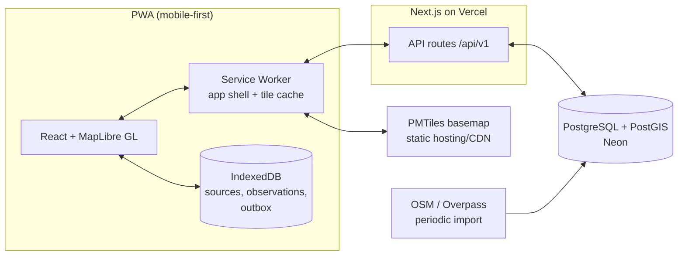

# Architecture

Technical direction for Sources du Vercors. [PROJECT.md](PROJECT.md) listed candidate technologies; this document records the **chosen** stack and the reasoning. Decisions marked **(decided)** are settled unless revisited deliberately; items marked **(open)** still need a call.

## Overview

A single Next.js application (frontend + API), PostgreSQL/PostGIS database, deployed as a PWA. Offline-first is the defining constraint and shapes almost every choice below.



## Stack (decided)

| Layer | Choice | Why |
|---|---|---|
| Framework | **Next.js (App Router) + TypeScript** | One deployable for UI + API; strong PWA story; matches the goal of demonstrating full-stack product engineering |
| UI | **React + Tailwind CSS** | Fast iteration, small surface |
| Map | **MapLibre GL JS** | Open-source, vector tiles, offline-capable, no vendor lock-in |
| Basemap tiles | **PMTiles (Protomaps build of OSM)** | Single-file vector tile archives served as static files with HTTP range requests — dramatically simplifies offline map download vs. running a tile server |
| API | **Next.js Route Handlers** under `/api/v1/*` | No separate backend to run; Hono can be revisited if the API outgrows this |
| Database | **PostgreSQL + PostGIS** | Geospatial queries (bbox, nearest-source) are core |
| ORM | **Prisma** | Productivity; PostGIS geometry handled via raw SQL / `Unsupported("geometry")` where needed — geo queries live in a small dedicated query module, not scattered |
| Auth | **Better Auth** | Lightweight, self-hosted, email magic-link first (no passwords to manage); OAuth later if wanted |
| Hosting | **Vercel** (app) + **Neon** (Postgres) | Free tiers fit MVP scale; both trivially replaceable |
| Photos (post-MVP) | S3-compatible object storage (e.g., Cloudflare R2) | Deferred entirely — schema keeps a nullable `photo_url` |

## Offline strategy (the core of the app)

Three layers of offline, in order of implementation:

1. **App shell** — Service worker precaches the application (standard PWA). The app opens with no network.
2. **Data** — Source list + derived statuses for the whole Vercors are small (a few hundred sources → well under 1 MB of JSON). On every online load, the client fetches the full snapshot and stores it in **IndexedDB**. Offline reads always hit IndexedDB first; the UI shows a "data as of <timestamp>" indicator (honesty principle).
3. **Map tiles** — User explicitly downloads the Vercors basemap (PMTiles archive, order of tens of MB for the massif at hiking zoom levels) for offline use. Until downloaded, tiles stream normally and the service worker caches what's viewed.

### Write path offline: the outbox

Observations/confirmations/disputes created offline are appended to an **outbox** in IndexedDB with a client-generated UUID and `observed_at` set to creation time, then replayed to the API when connectivity returns. **(decided, Phase 3)** Replay is client-side only — triggered on `online`, window focus/visibility, and a slow interval — rather than the SW Background Sync API: iOS has no Background Sync, so the focus path had to exist anyway, and one code path beats two. Replay stops on 401 (needs sign-in) and network/5xx (retry later); terminal 4xx drops the item rather than wedging the queue.

- The client UUID makes replay **idempotent** (server upserts by ID).
- `observed_at` (when the hiker was at the source) is distinct from `created_at` (when the server received it) — critical for confidence computation.
- Conflicts are a non-problem by design: observations are append-only facts; there is nothing to merge.

## Data flow: source statuses

Derived state `(status, confidence, last_observed_at, confirmations)` is computed **server-side** in one place (SQL view or query — see [DATABASE.md](DATABASE.md)) and shipped to clients as part of the snapshot. Clients never re-derive confidence with different rules; offline they may only re-bucket **age-based decay** (a source cached as High confidence 10 days ago must degrade), using the same constants exported from a shared module.

## API sketch (v1)

Small, boring, versioned:

- `GET  /api/v1/sources` — full snapshot: all sources + derived status (the offline sync payload; ETag/If-None-Match)
- `GET  /api/v1/sources/:id` — source detail + recent observation history
- `POST /api/v1/observations` — create (idempotent by client UUID; auth required)
- `POST /api/v1/observations/:id/confirm` — confirm (auth required)
- `POST /api/v1/observations/:id/dispute` — report outdated (auth required)

No GraphQL, no realtime. Snapshot + poll is plenty at this scale.

## Cross-cutting decisions

- **PWA, not native.** One codebase, no app-store friction. Accepted trade-offs: iOS PWA storage-eviction quirks and no reliable Background Sync on iOS (mitigation: sync on app focus; warn users not to delete the "installed" app).
- **Hand-rolled service worker (decided, Phase 3):** `public/sw.js`, plain JS, no Workbox/next-pwa. Next hashes chunk URLs, so the install step discovers app-shell assets by parsing the served HTML (and its CSS for fonts) instead of a build-time manifest. The downloaded PMTiles archive lives whole in Cache Storage (`sdv-basemap-v1`, unversioned — SW updates must not discard a 40 MB download); the SW answers MapLibre's Range requests by slicing it. `/api/*` is never SW-cached — offline data comes from IndexedDB only, one staleness model.
- **Offline session mirror (decided, Phase 3):** Better Auth's `useSession` needs the network, but a signed-in hiker offline must still see the report form. The last definitive session answer is mirrored to localStorage (`lib/offline/session.ts`) and used only when the session fetch errors; a definitive signed-out clears it. The outbox replay itself authenticates with the normal cookie.
- **Offline e2e simulates airplane mode by killing the server (decided, Phase 3):** browser-level network emulation doesn't reliably apply to service-worker fetches, so the Playwright spec owns a real `next start` (port 3210, separate `.next-e2e` build via `NEXT_DIST_DIR`, magic link read from server stdout) and kills/restarts it. Test data hangs off one dedicated `.test`-domain user, hard-deleted before and after each run.
- **Account deletion is not identity-permanent (decided 2026-08-04):** anonymisation releases the email, so a deleted user can sign up again with the same address and gets a fresh `user.id`. Accepted as-is: their previous contributions stay anonymised on the map and out of their reach, and repeated cycles only accumulate orphan `user` rows. Rejected the alternatives — a deny-list would make deletion a permanent ban on the address, and re-linking a returning email to the old row would rebuild the identity trail deletion just destroyed (DOMAIN.md § Users & trust).
- **i18n from day one (decided):** UI French-first; all user-facing strings live in a typed message catalog (`lib/i18n/fr.ts`), no i18n library for now. Revisit the library question when English is actually added.
- **MapLibre pinned to v5:** maplibre-gl 6.0.0 (released 2026-07) silently fails to load any style in our setup (style stays unparsed, no errors emitted). Stay on ^5 until v6.x is verified working.
- **Performance budgets:** initial JS < 300 KB gzipped (MapLibre dominates; code-split everything else); map interactive < 3 s on a mid-range phone over 4G.
- **Privacy:** no tracking of user location server-side; geolocation is used client-side only to center the map. No analytics beyond privacy-friendly aggregate counts (open: Plausible vs. nothing).
- **Testing:** unit tests for the confidence/derivation logic (the one algorithm that matters), integration tests for API routes, one Playwright happy-path (view map → open source → submit observation) including an offline-mode scenario.

## Repository layout (planned)

Single app repo, no monorepo tooling until needed:

```
/app            Next.js App Router (pages + API route handlers)
/components     React components
/lib            domain logic (confidence rules, status derivation, shared constants)
/lib/db         Prisma client + geo query module (raw SQL lives here only)
/lib/offline    IndexedDB access, outbox, sync
/prisma         schema.prisma + migrations
/scripts        OSM import + data tooling (see DATA_SOURCES.md)
/public         PWA manifest, icons
```

## Revisit triggers

- If Prisma + raw-SQL PostGIS becomes painful → evaluate Drizzle or Kysely.
- If snapshot payloads outgrow ~5 MB (multi-massif future) → move to bbox/tile-scoped data endpoints.
- If Vercel serverless limits bite (import jobs, image processing) → move background jobs to a small worker (Railway).
